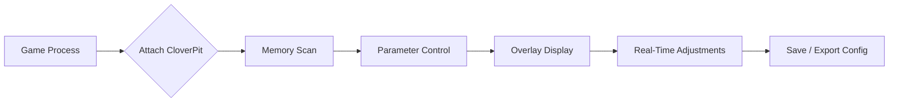

# 🌿 CloverPit Trainer – Complete Setup & Features Guide

The **CloverPit Trainer** is a multifunctional gameplay modification suite designed for players who want total control over their in-game experience. Whether you’re testing mechanics, tweaking balance, or simply personalizing your sandbox adventure, CloverPit provides the interface, precision, and customization depth you’ve been looking for.

---

## 🧭 Overview

Built for PC titles and compatible with multiple engines (Unreal, Unity, and proprietary frameworks), **CloverPit Trainer** empowers players with live data access and modifiable gameplay parameters. It’s not a mere cheat—it's a **debug-grade environment tool** trusted by testers and speedrunners alike.

### Highlights:

* Hot-reload modifications in real time.
* Fine-tune physics, damage, AI, and camera parameters.
* Save, export, and share config sets for different games.
* Create repeatable experiment conditions for QA or creative play.

---

## ⚙️ Core Features

| Function                    | Description                                           | Example Use                                    |
| --------------------------- | ----------------------------------------------------- | ---------------------------------------------- |
| 🎯 **Parameter Tweaker**    | Adjust gravity, speed, damage, or stamina on the fly. | “SetSpeed=1.4x” for faster exploration.        |
| 👁 **Visual Debug Overlay** | Toggle object bounds, hitboxes, and AI routes.        | Great for map designers.                       |
| 🧩 **Scripting Module**     | Run Lua or JSON macros for automated behavior.        | Automate healing at <40% HP.                   |
| 🕹 **Control Mapper**       | Bind hotkeys for quick toggles and test modes.        | `CTRL+F3` → Freeze AI.                         |
| 💾 **Save State Engine**    | Snapshot and reload any gameplay frame instantly.     | QA regression testing or repeated boss phases. |

[!NOTE]

> Each module can be toggled individually to maintain performance. CloverPit automatically optimizes CPU load during active gameplay.

---

## 🪟 Compatibility

| Platform           | Support         | Notes                          |
| ------------------ | --------------- | ------------------------------ |
| **Windows 10/11**  | ✅ Full          | DirectX 12 & Vulkan compatible |
| **Linux (Proton)** | ⚙️ Partial      | Requires DXVK enabled          |
| **Steam Deck**     | 🧩 Experimental | Overlay functions limited      |

> [!IMPORTANT]
> For smooth initialization, **run CloverPit as Administrator** and ensure your antivirus allows the process. False positives are common for runtime debuggers.

---

## ⚡️ Setup & Configuration

1. **Download & Extract**

   ```bash
   CloverPit_Setup_v3.9.zip → C:\Games\CloverPit\
   ```
2. **Run Installer**

   ```bash
   CloverPit.exe /setup
   ```
3. **Select Game Process**

   * Auto-detect supported games or add manually.
   * Example:

     ```bash
     attach.exe --pid 00452 --mode dev
     ```
4. **Load Config Profile**

   * Choose from prebuilt profiles:

     * `sandbox-balanced.json`
     * `ultra-speedrun.cfg`
     * `qa-testing-lite.ini`
5. **Launch**

   ```bash
   start CloverPit --overlay --safe
   ```

> [!WARNING]
> Avoid modifying encrypted online sessions—CloverPit is meant for **offline or private test modes** only.

---

### 🔄 Mermaid Flow Diagram



---

## 💡 Tips & Optimization

* Keep your **config cache under 200KB** for instant reloads.
* Use the **“Shadow Mode”** when testing UI-heavy overlays.
* Combine macros with **gamepad shortcuts** via Control Mapper for fluid transitions.
* Backup your `/profiles` folder before updates—each version refreshes its offsets.

---

## ❓ FAQ

**Q1: Is CloverPit Trainer safe to use?**
Yes, it’s built for offline and custom environments. Always disable overlays when connecting to online services.

**Q2: Can I create my own scripts?**
Absolutely. The scripting module supports Lua and JSON macros for automating gameplay events.

**Q3: Does it impact FPS?**
Minimal impact (<2%) due to adaptive tick control and overlay optimization.

**Q4: How often is it updated?**
Monthly builds are released to sync with popular engines’ updates.

**Q5: Can I share configs with others?**
Yes. Configs are lightweight and exportable. Use the built-in “SharePack” option.

---

## 🧠 Final Thoughts

CloverPit Trainer is more than a tweak utility—it’s a creative instrument for players and testers who crave **control, insight, and replay precision**. From balancing sandbox worlds to designing custom challenge runs, this trainer gives you the leverage to bend your game universe to your will.

---

*© 2025 CloverPit DevWorks. Built for precision, passion, and perfect testing.*
