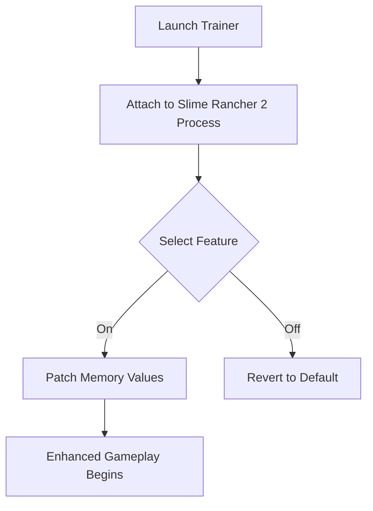

# 🌾 CloverPit Trainer

Enter the realm where **ranching turns into mastery**.
The **CloverPit Trainer** transforms *Slime Rancher 2* into a sandbox of pure freedom — granting infinite resources, unlimited stamina, and instant command over every element of the game world.

Tailored for creators and dreamers, this trainer is more than a cheat: it’s a **power console** for exploration, experimentation, and speedrunning brilliance.

---

## 🌈 Overview

The **CloverPit Trainer** is an external modification tool crafted for *Slime Rancher 2 (PC)*.
It safely adjusts live memory values while keeping your saves stable — giving you fast access to **infinite money**, **no-cooldown gadgets**, and **enhanced jetpack control**.

It’s sleek, stable, and updated with every patch to maintain full compatibility.

---

## ⚙️ Key Features

* **💰 Infinite Newbucks:** Skip the grind — instantly max your currency.
* **🔋 Infinite Energy:** Dash, jet, and vacuum endlessly.
* **🧪 Unlimited Items:** Duplicate any resource in your inventory.
* **🐣 Calm Slimes Mode:** Disable aggression for a peaceful island.
* **🎯 Instant Vacuum:** Boost range and suction speed by 10×.
* **🧭 Teleport Hotspots:** Warp to any biome or base.
* **🌙 Time & Weather Control:** Lock or accelerate day cycles.
* **🦋 Physics Override:** Adjust gravity or jump height live.

[!NOTE]
CloverPit uses a **non-destructive hook** that leaves game files untouched — it works entirely in memory.

---

## 💻 Compatibility

| Platform                  | Status        | Notes                              |
| ------------------------- | ------------- | ---------------------------------- |
| **Windows 10/11 (Steam)** | ✅ Full        | Auto-process detection             |
| **Game Pass (PC)**        | ⚠️ Manual     | Requires manual attach             |
| **Steam Deck**            | ⚠️ Partial    | Needs external keyboard overlay    |
| **Linux (Proton)**        | ❌ Unsupported | Not tested                         |
| **Consoles**              | ❌ Locked      | Not available outside PC ecosystem |

[!WARNING]
Do not run alongside other memory trainers — conflicts may occur.

---

## ⚡️ Setup Guide

Here’s how to begin your enhanced ranching adventure:

```bash
1. Download CloverPitTrainer_v2.8.zip
2. Extract to:
   C:\Program Files (x86)\Steam\steamapps\common\Slime Rancher 2\
3. Run CloverPit.exe as Administrator.
4. Launch Slime Rancher 2, then click “Attach Process.”
5. Use hotkeys or on-screen toggles to activate features.
```

Hotkey map:

```
F1 – Infinite Money  
F2 – Infinite Energy  
F3 – Unlock All Areas  
F4 – Calm Slimes  
F5 – Teleport to Player Home  
F6 – Freeze Time  
F7 – Disable Gravity
```

[!IMPORTANT]
Always **save manually before enabling world modifiers** to preserve your progress.

---

### 🧭 Trainer Operation Flow



---

## 🧩 Configuration Options

Modify the included `cloverpit_config.ini` for deeper tuning:

```ini
[Energy]
Infinite=True
JetpackBoost=3.0

[Economy]
MoneyMultiplier=5
AutoSell=True

[Environment]
TimeFrozen=False
Weather="Rainbow"

[Player]
WalkSpeed=2.8
JumpHeight=2.5
GravityScale=0.75
```

Changes are applied automatically on next launch.

---

## 🧠 FAQ

**Q: Does it work with other mods?**
A: Yes, CloverPit is compatible with both the official Mod Loader and third-party content mods.

**Q: Can I use it on existing saves?**
A: Absolutely — it reads your active save without altering its structure.

**Q: Is there an auto-update feature?**
A: Yes, it checks for new releases each launch and updates silently.

**Q: Will it cause bans?**
A: No. It’s a local tool and safe for offline play only.

**Q: Can I remap the hotkeys?**
A: Yes, in the Settings tab or via the config file.

---

## 🧠 Developer Mode

CloverPit also includes a *Developer Console* for those who crave deeper control:

```bash
> setgravity 0.5  
> settime 18:00  
> giveitem plort_honey 99  
> tp to coral_fields
```

These commands can be executed live while the game runs.

---

## 🌟 Final Thoughts

The **CloverPit Trainer** redefines how you experience *Slime Rancher 2* — it’s not just about shortcuts, but **freedom**.
Whether you’re experimenting with slime behavior, crafting a cinematic landscape, or simply relaxing in a world without limits, CloverPit gives you the tools to make it your own.

This is ranching without restriction — **pure creation, powered by control.**

---

**Grow bright, move free — CloverPit bends the island to your imagination.** 🌈
